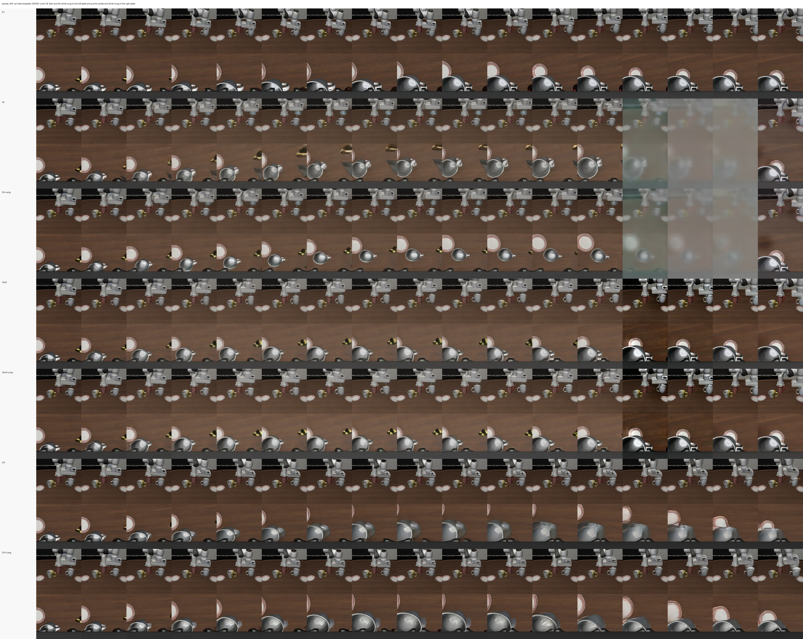
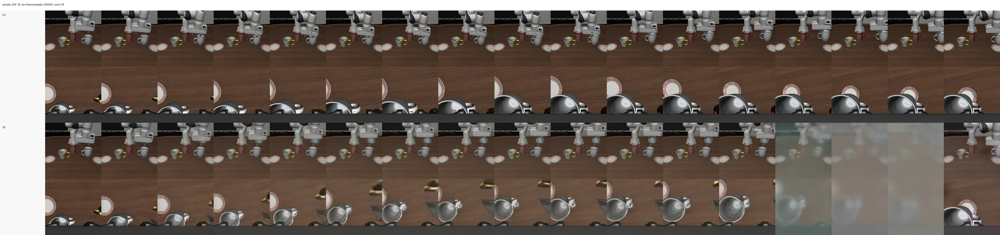
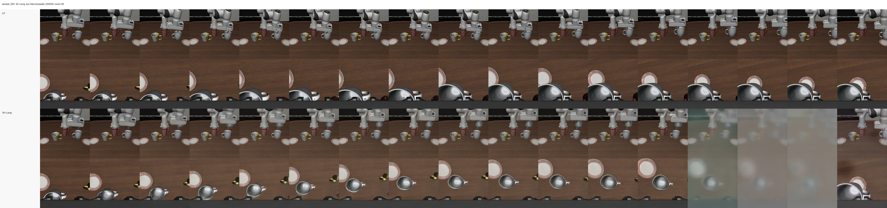
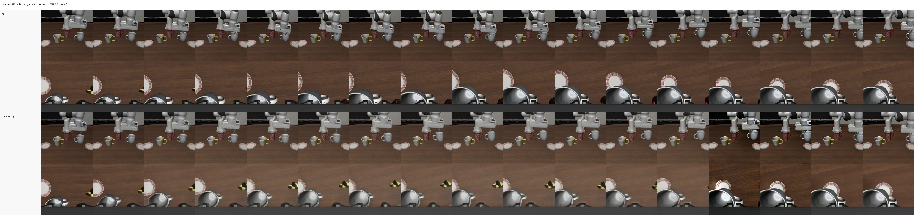
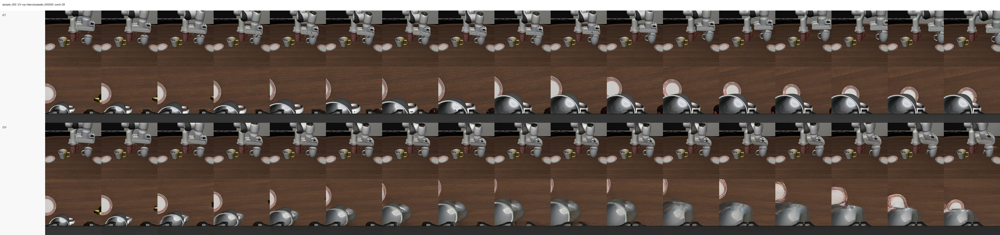
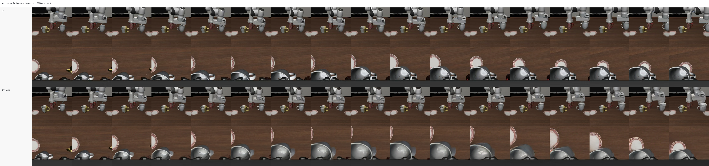

### VGM Bridge Stage 1 Experiment Archive

#### 归档目的

这份文档归档当前已经完成的 LIBERO VGM Bridge Stage 1 旧实验。它的目标不是把旧实验包装成最终结论，而是把已经做过的代码、数据、配置、训练任务、checkpoint、评估方式和可视化结果固定下来，方便后续回溯。

当前研究目标可以概括为：

```text
先训练一个机器人域的视频生成先验。
给定任务起点和目标状态，让 VGM 学会补出合理的中间过程。
后续再把这个过程先验用于 progress / value / reward model。
```

这些旧实验主要验证的是第一步：Wan/Motus 的 VGM 在 LIBERO 双视角机器人视频上，能否学到 first-last bridge、tail-conditioned bridge 和 first-only future prediction。

#### 代码版本

##### 归档基准 commit

```text
repository: /Users/n/Documents/DreamZero/repos/Motus
branch: codex/vgm-bridge-stage1
commit: f826b5a Add first-only VGM bridge training configs
```

这个 commit 是归档时本地和远端用于评估、加载 checkpoint、生成可视化的代码版本。早期实验是在同一分支的演进过程中启动的，后续提交保持了旧配置兼容。

##### 相关提交序列

```text
f826b5a Add first-only VGM bridge training configs
4a8ebbc Document VGM bridge visualization workflow
7ffe07d Add VGM bridge evaluation assets
39987d7 Add VGM bridge tail conditioning experiments
6dcff09 Set VGM bridge first run to 50k steps
43f92de Switch VGM bridge to LeRobot LIBERO videos
```

##### 主要代码入口

```text
models/vgm_bridge_stage1.py
train/train_vgm_bridge_stage1.py
train/eval_vgm_bridge_stage1.py
data/video_bridge/video_bridge_dataset.py
configs/vgm_bridge_v0.yaml
configs/vgm_bridge_v0_9f.yaml
configs/vgm_bridge_v0_lang.yaml
configs/vgm_bridge_v0_tail4.yaml
configs/vgm_bridge_v0_tail4_lang.yaml
configs/vgm_bridge_v0_i2v.yaml
configs/vgm_bridge_v0_i2v_lang.yaml
```

#### 数据和输入格式

##### 数据集

```text
remote dataset:
/mnt/workspace/users/niejunnan/lerobot_datasets/lerobot/libero

format:
LeRobot v3 video

eval scan:
1693 episodes
```

使用的图像列：

```text
observation.images.image
observation.images.image2
```

两个视角使用 `vertical` 方式拼接，然后 resize 到：

```text
448 x 224
```

语言实验使用任务级 UMT5/Wan embedding：

```text
/mnt/workspace/users/niejunnan/lerobot_datasets/lerobot/libero/umt5_wan_tasks
task_{task_index:06d}.pt
```

##### 采样窗口

17 帧主实验使用：

```text
num_video_frames: 16
global_downsample_rate: 3
```

实际窗口为：

```text
condition_idx
condition_idx + 3
condition_idx + 6
...
condition_idx + 48
```

也就是输入 VAE 的 full video 有 `1 + 16 = 17` 个采样帧，覆盖原始 episode 中 49 帧跨度。

9 帧诊断实验使用：

```text
num_video_frames: 8
global_downsample_rate: 3
```

实际窗口为：

```text
condition_idx
condition_idx + 3
...
condition_idx + 24
```

#### 模型和训练设置

##### Base Model

```text
Wan2.2-TI2V-5B

remote path:
/mnt/workspace/users/niejunnan/codebase/Motus/pretrained_models/Wan2.2-TI2V-5B

VAE:
/mnt/workspace/users/niejunnan/codebase/Motus/pretrained_models/Wan2.2-TI2V-5B/Wan2.2_VAE.pth
```

当前实验只训练 VGM 支线，不训练完整 Motus：

```text
included:
Wan VGM / video latent flow matching

excluded:
Action Expert
Understanding Expert
VLM feature path
proprio/state condition
real action condition
progress/value/reward head
```

##### 通用训练超参

所有正式 50k 实验使用同一组主超参：

```text
per-GPU batch size: 4
num GPUs: 2
global batch size: 8
gradient accumulation: 1
max steps: 50004
learning rate: 1.0e-5
weight decay: 0.01
scheduler: diffusers cosine
warmup steps: 1000
min lr: 1.0e-6
precision: bfloat16
save interval: 2500
```

##### 训练机器和 checkpoint

正式 checkpoint 归档在 25605：

```text
/mnt/workspace1/users/niejunnan/codebase/Motus/checkpoints
```

每个正式实验都有：

```text
checkpoint_step_50004
```

还有一个更早的 legacy/smoke 目录只到 10000 step：

```text
checkpoints/vgm_bridge_v0/vgm_bridge_v0
```

这个目录不作为正式 50k 对比实验使用。

#### 实验矩阵

##### V0 17f Bridge

配置：

```text
configs/vgm_bridge_v0.yaml
```

条件：

```text
first frame + last frame
```

训练目标：

```text
补中间 sampled frames
latent known mask clamp first/last temporal latent slice
loss 只算 unknown middle latent
```

这个实验是最小 first-last bridge baseline。

##### V0 17f Bridge + Language

配置：

```text
configs/vgm_bridge_v0_lang.yaml
```

条件：

```text
first frame + last frame + task language embedding
```

训练目标和 V0 17f 相同。这个实验用于验证 task language 是否能改善中间过程生成。

##### Tail4 17f Bridge

配置：

```text
configs/vgm_bridge_v0_tail4.yaml
```

条件：

```text
first frame + last 4 sampled frames
```

具体条件帧：

```text
condition_idx
condition_idx + 39
condition_idx + 42
condition_idx + 45
condition_idx + 48
```

训练目标：

```text
生成 condition_idx + 3 到 condition_idx + 36 的 12 个 sampled frames
```

这个实验用于验证 V0 灰雾问题是否来自尾部 VAE temporal chunk 不完整。相比单张 last frame，Tail4 让最后一个 temporal latent chunk 由真实尾部帧填充。

##### Tail4 17f Bridge + Language

配置：

```text
configs/vgm_bridge_v0_tail4_lang.yaml
```

条件：

```text
first frame + last 4 sampled frames + task language embedding
```

这个实验用于验证 Tail4 和语言条件是否能叠加收益。

##### I2V 17f First-Only

配置：

```text
configs/vgm_bridge_v0_i2v.yaml
```

条件：

```text
first frame only
```

训练目标：

```text
生成后续 16 个 sampled frames
```

这个实验用于测试 VGM 从单帧续写机器人未来视频的能力。它不是 first-last bridge，而是更接近 I2V / TI2V-style future generation。

##### I2V 17f First-Only + Language

配置：

```text
configs/vgm_bridge_v0_i2v_lang.yaml
```

条件：

```text
first frame + task language embedding
```

训练目标和 I2V 17f 相同。这个实验用于验证语言是否能减少 first-only future prediction 的多模态不确定性。

##### V0 9f Bridge

配置：

```text
configs/vgm_bridge_v0_9f.yaml
```

条件：

```text
first frame + last frame
```

窗口：

```text
condition_idx
condition_idx + 3
...
condition_idx + 24
```

这个实验是短 horizon 诊断，用于观察更短时间跨度和更少 latent temporal slice 下是否能缓解灰雾或模糊问题。

#### 评估设置

##### 固定窗口可视化

主评估使用固定 16 个 LIBERO windows：

```text
num_samples: 16
batch_size: 1
loss_repeats: 1
num_inference_steps: 50
seed: 50
fps: 4
```

评估输出目录：

```text
remote:
/mnt/workspace1/users/niejunnan/codebase/Motus/eval_outputs/vgm_bridge_compare_17f_step50004_s50_16samples

local:
/Users/n/Documents/DreamZero/artifacts/vgm_bridge_compare_17f_step50004_s50_16samples
```

已校验 6 个 17f 主模型的核心窗口字段完全一致：

```text
episode_name
condition_idx
frame_indices
total_frames
```

语言模型的 `task_text` / `task_index` 只作为附加元数据，不用于窗口一致性判断。

##### 归档进仓库的评估资产

```text
assets/vgm_bridge_stage1_archive/sample_000/
assets/vgm_bridge_stage1_archive/metrics/metrics_summary_step50004.csv
assets/vgm_bridge_stage1_archive/metrics/metrics_summary_step50004.json
```

#### 训练日志结果

##### 最后一步训练日志 loss

这是训练日志里的最后一步 instantaneous loss，不等价于固定窗口 eval loss。

| Variant | Step | Last train log loss |
| --- | ---: | ---: |
| V0 17f | 50004 / 50004 | 0.1869 |
| V0 9f | 50004 / 50004 | 0.1546 |
| V0 17f + Language | 50004 / 50004 | 0.4706 |
| Tail4 17f | 50004 / 50004 | 0.1190 |
| Tail4 17f + Language | 50004 / 50004 | 0.1261 |
| I2V 17f | 50004 / 50004 | 0.2963 |
| I2V 17f + Language | 50004 / 50004 | 0.1673 |

##### 固定窗口 eval metrics

这是 16 个固定窗口、50 inference steps 的评估结果。

| Variant | Eval total loss | Generated MSE | Generated PSNR | Middle MSE | Condition MSE |
| --- | ---: | ---: | ---: | ---: | ---: |
| V0 17f | 0.2519 | 0.0281 | 15.63 | 0.0281 | 0.0017 |
| V0 17f + Language | 0.2436 | 0.0296 | 15.42 | 0.0296 | 0.0018 |
| Tail4 17f | 0.2355 | 0.0175 | 17.84 | 0.0148 | 0.0028 |
| Tail4 17f + Language | 0.2259 | 0.0181 | 17.71 | 0.0153 | 0.0028 |
| I2V 17f | 0.2232 | 0.0198 | 17.26 | 0.0195 | 0.0002 |
| I2V 17f + Language | 0.2194 | 0.0194 | 17.33 | 0.0190 | 0.0002 |
| V0 9f | 0.2457 | 0.0298 | 15.34 | 0.0298 | 0.0010 |

###### 指标解释

`Eval total loss` 是固定窗口上重新采样 timestep 后得到的 latent flow-matching loss。`Generated MSE/PSNR` 是对真正生成区域计算的像素指标。它们只能辅助判断训练健康与重建接近程度，不能单独证明模型学到了机器人任务过程。

#### 可视化结果

##### Sample 000: all variants overview



##### Sample 000: V0 17f



##### Sample 000: V0 17f + Language



##### Sample 000: Tail4 17f


##### Sample 000: Tail4 17f + Language



##### Sample 000: I2V 17f



##### Sample 000: I2V 17f + Language



#### 观察和结论

##### V0 能跑通，但不是足够强的最终方案

V0 证明了最小 first-last latent clamp 训练可以跑通，也能在机器人域生成与 GT 大体相似的中间过程。但 V0 的尾部存在明显灰雾或半透明块，说明只 clamp 单张 last frame 的条件方式存在结构性问题。

##### Tail4 是当前旧实验里最有效的修正

Tail4 的 generated MSE 和 PSNR 明显优于 V0。这个结果支持之前的判断：

```text
V0 的灰雾问题很可能来自尾部 temporal VAE chunk 不完整。
```

Tail4 把最后 4 个 sampled frames 作为真实尾部条件，能显著改善最后 latent chunk 的边界条件。

##### Language 单独不是决定性修复

语言条件能降低某些 eval loss，但没有稳定改善像素指标，也没有根治 V0 的尾部灰雾。当前语言 embedding 更像是任务语义补充，不能替代更强的视觉 endpoint conditioning。

##### I2V/TI2V-style 不是当前目标的最佳验证方式

I2V 和 I2V+Lang 从指标上并不差，但它们回答的是：

```text
只给 first frame, 模型能不能续写未来视频
```

这不是最初 Stage 1 的核心目标。最初目标是：

```text
给定 start state 和 goal state, 学机器人从 A 到 B 的过程先验
```

因此 I2V 结果应该作为辅助对照，而不是主路线。

##### 旧实验没有验证真正的 V1

当前已经完成的是 V0、Tail4、I2V 及其语言消融。还没有真正实现和验证 V1：

```text
condition_latent + known_mask 显式注入模型
```

因此不能用 V0 的问题直接否定整个 first-last-frame robot VGM prior 方向。更合理的结论是：V0 作为最小 probe 已经暴露了瓶颈，下一步应该进入 V1。

#### 当前局限

##### 不是 full Motus

这些旧实验没有使用：

```text
Action Expert
VLM / Understanding Expert
observation.state
real action
latent action
```

所以它们不能和 RoboTwin 官方 `Motus_robotwin2` 的可视化直接对比。RoboTwin 那条链路是 full Motus Stage 3 fine-tuned model，而这里是 VGM-only Stage 1 probe。

##### 条件不足导致未来多模态

尤其是 I2V/TI2V-style 设置，给定第一帧和语言并不能唯一确定机器人未来轨迹。夹爪接触、运动路径、速度和开合时机都可能有多种合理答案。

##### 高频细节不受全图 latent loss 强约束

夹爪、末端、物体边缘在全图 latent/video loss 中占比很小。模型可能把桌面和大范围运动拟合得不错，但末端夹爪逐渐模糊。

##### 当前 loss 约 0.2 不是单纯训练不够

固定窗口 eval loss 和训练日志 loss 都显示模型进入了一个较稳定区间。继续把 V0/I2V 从 50k 训到更久，可能小幅改善 loss，但不太可能根治条件不足和尾部 chunk 结构问题。

#### 下一步建议

##### 进入 V1 endpoint-conditioned VGM

下一步应实现并验证：

```text
first frame
last frame
language
known_mask
condition_latent = VAE([first, zeros..., last])
```

并通过 adapter 或其他不破坏 Wan patch embedding 的方式显式注入：

```text
condition_latent + known_mask
```

目标是验证 V1 是否比 V0 更听 last frame、更少尾部灰雾、更稳定保留物体和夹爪结构。

##### 加入 task-aware 细节评估

下一轮评估不应只看全图 sheet。应增加：

```text
gripper crop GT vs Pred
object crop GT vs Pred
final frames crop metrics
late-frame loss
ROI pixel/feature loss
```

##### 再考虑 Stage 2 progress/value

只有当 V1 的任务相关视频过程先验足够稳定后，再进入 Stage 2：

```text
freeze or partially finetune VGM
add progress/value/reward head or expert
train with progress ranking / success contrast / distance-to-goal targets
```

Stage 2 的目标不是让像素更清晰，而是把 VGM 学到的机器人过程先验转成可以评价轨迹的 progress/value/reward 表征。

###### 归档结论

旧实验已经完成了 VGM Stage 1 的 V0/Tail4/I2V 消融，证明了工程链路、数据链路、checkpoint 和评估链路都可用；同时也暴露出 V0 条件方式和 I2V 多模态预测的明显上限。下一阶段应从继续堆 V0 训练，转向实现真正的 V1 显式 endpoint conditioning。
